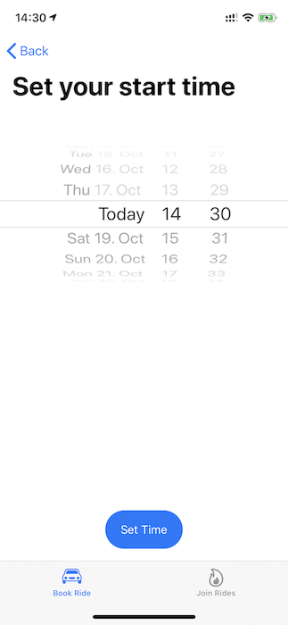
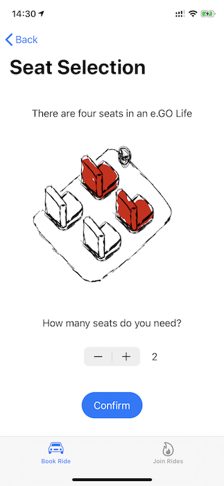

# Hackathon by e.GO Digital Team Moose 🦌

## Obective
The task given was to enhance the e.GO Digital e.Base platform with following objectives:

* Increase usage of station based car sharing in e.Base supporting settlements
* Decrease output of CO2 
* Motivate users by gratifiying good behavior

## Pitch
Our vision is that people in an e.Base supported settelment could post public car sharing bookings, e.g. dropping of kids at the nearby school or going to a concert in town. This way others can join for the ride and split the cost of the ride itself and also help decreasing CO2 by more efficient commute compared to cars with free seats. 
In addition to that local venues and activities will be publicly visible this way and give inspiration. By increasing carpooling in a local community we might also be able to increase the social network in such a settelment.

## Context
Our idea positions itself as a new type of booking in e.Base platform that is public.
So it needs to be considered that our UI/UX starts asuming that the user is fully aware that all entered information will be public. 
For reduced complexity we also left out infrastructure like payments and user profiles even though such commodities would be needed for an actual launchable product.

## User Flow

1. Our flow starts with the question "Where are you going?" in the "Book Rides" tab. Here the user is supposed to tell us of the intended target location. If a booking to this location is all ready scheduled for the near future we will bring the user to page 2. else if no booking for this location is available, we will route the user to screen 3. 
	

2. If one or more bookings to the same location are scheduled for the near future, we will display the user a list of available bookings that could be joined. They can see the starting and end times of these bookings and by whom they are created. If the user decides that a booking is suitable for their pusposes they can select the entry and will be routed to page 3. if non of the listed bookings is suitable they can select a call to action at the bottom of the screen so that they will be routet to screen 4. 

3. This screen is a detail view of an actual booking, here a user can join an existing booking. We consider this the happy path.  

4. On this screen the user is able to enter the starting and end time of their intended trip, in order to continue the creation of a new public booking. After completion of which the user will be routed to screen 5. 

5. On this screen the user is asked to enter how many of the available seats are initially occupied, e.g. when the user intends to take their partner or a friend with him. After successfully entering this information the user is routed to screen 6. 

6. On this screen the user will be informed that they successfully completed the process of creating a public booking so that people in their local community can join in on the fun. Thereby benefitting the environment, reducing cost for the driver, increasing e.Base uttilisation and connecting people by shared commute. To further compliment the user for this a congratulatory trophy will be displayed to honor the user for this behavior. 

7. Users can also see a list of all public bookings in their community by going to the "Join Rides" tab of the application. 

## Secret Tricks

When you are on screen 6. and tap the trophy a few notifications will be displayed once you send the app to the background. 

